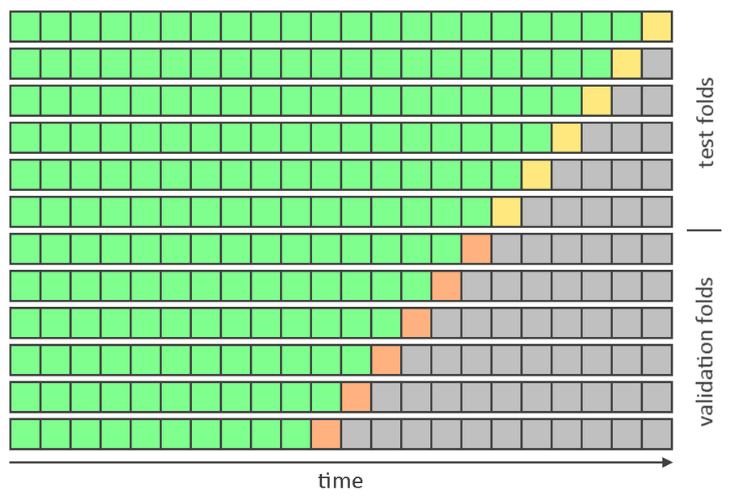

# Walmart Sales Forecasting

## Installation instructions
- Clone the repo
- Download the [dataset](https://www.kaggle.com/datasets/aslanahmedov/walmart-sales-forecast/) and put the archive into data/raw. No need to extract it
- Install Poetry as described [here](https://python-poetry.org/docs/#installation)
- Install Python 3.9 and make sure it's active in the repo root directory by running ```python --version```. I'd recommend using [pyenv](https://github.com/pyenv/pyenv) for this
- Run ```poetry install```
- Run ```poetry run process-raw-data```

## Task description
Data and features description can be found in ```notebooks/eda.ipynb```.  

The dataset allows to solve different kinds of tasks with it. I'll formulate it here as forecasting weekly sales 4 weeks ahead, having all available history up to the week just before the first forecasted week. Horizon, however, can be extended easily by changing HORIZON parameter in ```src/walmart_sales/constants.py```.  

My assumption is that during inference it's going to be used with the same stores and departments that existed in the train set. Otherwise, the evaluation should be more tricky and treat some departments as unavailable for training to simulate such situation.

## Model selection and evaluation
- Last weeks of data are dedicated for validation and testing. 
- Split is based on forecasting_week column. All feature values are known prior to forecasting_week, so splitting on this column and using samples with smaller forecasting_week for train prevents data leakage. 
- Validation and test are done in folds to decrease variance of estimators. 
- Validation folds are used for model selection, while test folds are for evaluation. Metric calculated on test folds should be used as an unbiased error estimation. 
- Data shows strong yearly seasonality, so ideally there should be at least 52 folds in test. I used 12 both for test and validation to save time. It can be configured by changing corresponding parameters in ```src/walmart_sales/constants.py```.
- Validation is schematically visualized on the image below. Each square is a single forecasting_week. Green squares represent training data for each fold. Yellow and orange squares are used to calculate error. Gray squares are not used in corresponding folds.  




## Metrics
I chose SMAPE to measure quality for several reasons:
- Each department has its own magnitude of sales, so relative metrics seem to be more interpretable.  
- There are some target values that are zero or very close to it. MAPE is not stable in such cases, while SMAPE works fine.
- SMAPE/WAPE choice depends on business needs. WAPE would prioritize bigger departments, and can be more susceptible to overfitting. I chose SMAPE assuming that each department is equally important.


## Modelling
- Baseline model is forecasting with a sales value of the last available week. It can be found in ```notebooks/baseline.ipynb```.
- Also I tried a boosting model, which is in ```notebooks/boosting.ipynb```.


## Code quality and testing
- I use flake8, black, and mypy to improve code quality.
- Linting can be run by a command ```./lint.sh```.
- Tests can be run by a command ```poetry run pytest```.


## Further improvement
Here are the steps I would take if I had more time:  
- Work more on extracting features and feature engineering. The most obvious here a is yearly lag that would exploit strong yearly seasonality.
- Set up experiment tracking, such as MLflow.
- Try some other heuristics, such as forecasting average sales value in last N weeks available.
- Try linear models. 
- Optimize a dataframe, for example by picking more suitable pandas dtypes. It already takes 1+ Gb and it can grow if we want to use more features or forecast for longer horizon.
- Use GPU training for a boosting model to make it faster,  improve experimenting speed, and allow more iterations for hyperparameter search.
- Set up parameters and bounds for hyperparameter search more mindfully. Bounds should be adjusted when best parameters are meeting them.
- Set up pre-commit hook for linting and testing, use coverage tool to control and improve test coverage. 
